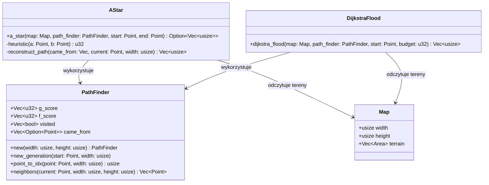

# Dokumentacja Techniczna Algorytmów Grafowych
Moduł algorytmów przestrzennych stanowi kluczowy element silnika symulacji, odpowiadający za nawigację, wyznaczanie optymalnych tras oraz analizę dostępności terytorialnej na dwuwymiarowej siatce mapy. Wszystkie algorytmy uwzględniają fizyczne ukształtowanie terenu (typ wyliczeniowy ***Elevation***), dynamizując koszt przejścia między sąsiadującymi komórkami.

**Standardowe stałe kosztów przemieszczania:**
**MOVE_COST = 10 (koszt ruchu w pionie i poziomie)**
**PENALTY = 100 (mnożnik kary wysokości)**

## 1. Architektura Struktur i Zarządzanie Pamięcią
W ogólności, dla zachowania wysokiej wydajności oraz ciągłości pamięci podręcznej (cache-friendly), algorytmy rezygnują ze struktur opartych na haszowaniu (takich jak `HashMap` czy `HashSet`) na rzecz płaskich, jednowymiarowych wektorów zorientowanych indeksowo. Przejście z indeksowania dwuwymiarowego (x, y) na jednowymiarowe realizowane jest przy pomocy relacji: *idx = y * WIDTH + x*.

## 2. Struktura PathFinder
Struktura ***PathFinder*** pełni rolę scentralizowanego bufora pamięci dla algorytmów przeszukiwania przestrzeni. Alokuje ona wektory o rozmiarze mapy (***WIDTH*** * ***HEIGHT***) wyłącznie raz podczas inicjalizacji, co zapobiega kosztownym alokacjom na stercie w trakcie trwania symulacji.

### 2.1 Pola Struktury

- **g_score** (`Vec<u32>`): Przechowuje najmniejszy znany koszt dotarcia ze startu do danej komórki. Domyślnie inicjalizowany wartością `u32::MAX`.
- **f_score** (`Vec<u32>`): Przechowuje sumę kosztu g_score oraz heurystycznej oceny dystansu do celu.
- **visited** (`Vec<bool>`): Flaga określająca, czy dany wierzchołek został już przetworzony (zamiennik zbioru `ClosedSet`)
- **came_from** (`Vec<Option<(usize, usize)>>`): Drzewo najkrótszych ścieżek, przechowujące współrzędne rodzica dla danej komórki.

### 2.2 Metody Pomocnicze i Cykl Pracy

- `new_generation`: Resetuje stany wektorów dla nowego zapytania przy użyciu wydajnej operacji `.fill()`, ustawiając punkt startowy z kosztem początkowym równym 0.
- `point_to_idx`: Odpowiada za deterministyczne przekształcanie współrzędnej dwuwymiarowej na indeks liniowy w wektorach mapy.
- `neighbors`: Wyznacza listę legalnych sąsiadów w 4-spójnym układzie współrzędnych (góra, dół, lewo, prawo), weryfikując warunki brzegowe mapy (0..width oraz 0..height).

## 3. Algorytm Wyznaczania Ścieżek: A*
Algorytm A* służy do odnalezienia optymalnej (najtańszej) ścieżki pomiędzy dwoma punktami na mapie (*start* -> *end*), uwzględniając wysokość terenu.

### 3.1 Heurystyka i Koszt Przejścia
Algorytm wykorzystuje heurystykę opartą na odległości ***Manhattan***, pomnożonej przez bazowy koszt ruchu ***MOVE_COST***:

*h(a,b) = (|a.x - b.x| + |a.y - b.y|) * MOVE_COST*

Całkowity koszt przejścia między sąsiadami uwzględnia różnicę wysokości terenu (***delta_elevation***), karząc za wspinaczkę oraz strome zejścia zgodnie ze wzorem:

*move_cost = MOVE_COST + (|delta_elevation| * PENALTY)*

### 3.2 Kolejna Priorytetowa i Leniwe Usuwanie
Proces sterowany jest przez kopiec binarny (`BinaryHeap`), sortujący wierzchołki malejąco według najniższej wartości f_score (zastosowanie `Reverse`). W celu optymalizacji zrezygnowano z kosztownego przeszukiwania kolejki. Jeśli wierzchołek zostaje dodany ponownie z lepszym wynikiem, starsza (gorsza) instancja jest ignorowana po ściągnięciu ze sterty dzięki weryfikacji flagi w wektorze `visited` (*lazy deletion*).

### 3.3 Rekonstrukcja Trasy (`reconstruct_path`)
Po osiągnięciu komórki docelowej następuje odtworzenie trasy od celu do startu na podstawie bufora `came_from`. Końcowa ścieżka jest odwracana i zwracana w formie jednowymiarowego wektora indeksów (`Vec<usize>`), gotowego do bezpośredniego użycia przez silnik mapy.

## Algorytm Zalewowy: Dijkstra Flood
Algorytm *Dijkstra Flood* (ekspansja Dijkstry z limitem kosztów) służy do wyznaczania strefy zasięgu, czyli wszystkich komórek możliwych do osiągnięcia z punktu startowego w ramach określonego budżetu punktów ruchu (*budget*).

### 4.1 Specyfika Działania i Bariera Budżetu
- **Granica oceanu:** Algorytm automatycznie odrzuca ekspansję na tereny poniżej poziomu morza (***Elevation::OCEAN_LEVEL***).

- **Bariera rzeźby terenu:** Im większa różnica wysokości między komórkami (wysoka wartość delta_elevation), tym szybsze wyczerpanie dostępnego parametru budget. Powoduje to naturalne dostosowywanie się kształtu zalanej strefy do ukształtowania geograficznego.

- W odróżnieniu od algorytmu A*, funkcja ta nie posiada punktu docelowego ani heurystyki (*h(x) = 0*). Ekspansja odbywa się równomiernie we wszystkich kierunkach na podstawie samego kosztu `g_score`.

- Wynikiem działania algorytmu jest wektor indeksów liniowych(`Vec<usize>`) reprezentujących spójny terytorialnie obszar dostępny w danym budżecie ruchu.