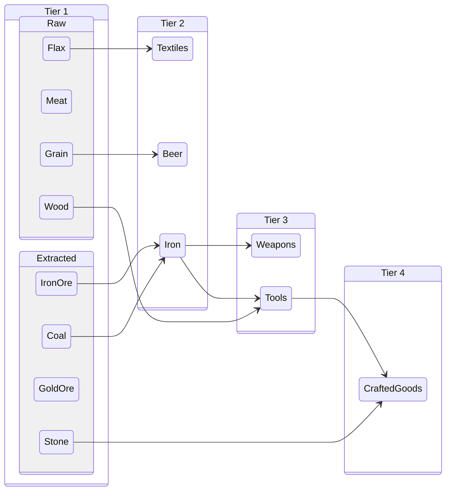
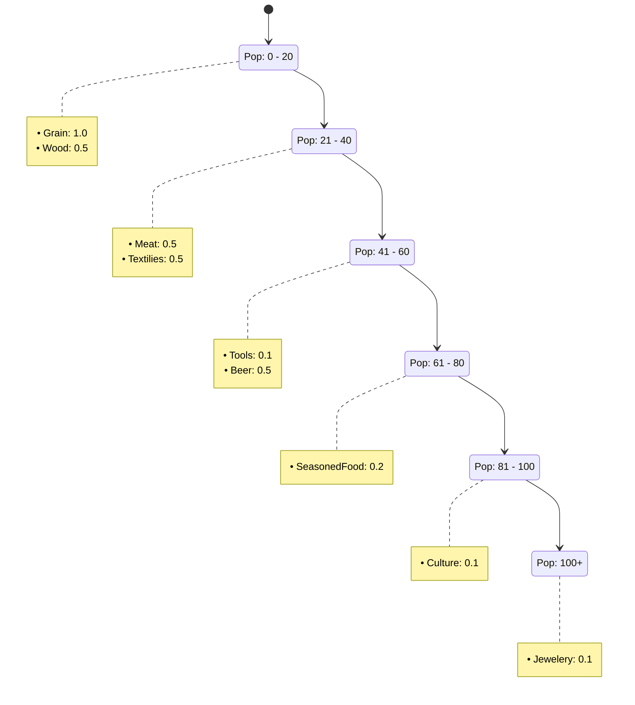

# Resources
Resources are physically generated on the world map or crafted in specific production chains *(using materials)*. Players use them in order to satisfy escalating population *(goods)* needs or construct buildings *(building)*.

## Resource Tiers 
### Tier 1: Fundamentals
Gathered directly from map tiles. Fulfills basic population satisfaction.
- **Raw:** 
	- `Flax`, 
	- `Meat`,    
	- `Grain`, 
	- `Wood`
- **Extracted:** 
	- `IronOre`, 
	- `Coal`, 
	- `GoldOre`, 
	- `Stone`

### Tier 2: Processed Goods
Refined in mid-level settlements for advanced population needs
- **`Textiles`** ⟵ _Flax_  
- **`Beer`** ⟵ _Grain_      
- **`Iron`** ⟵ _IronOre + Coal_ 
    
### Tier 3: Advanced Manufacturing
Complex items required for high-tier population satisfaction and growth.
- **`Weapons`** ⟵ _Iron_   
- **`Tools`** ⟵ _Wood + Iron_ 

### Tier 4: Luxury Goods
Endgame commodities for maximum population satisfaction.
- **`CraftedGoods`** ⟵ _Tools + Stone_

# Population Demands

# Buildings

| **Name               | **Cost**                         | **Workers Capacity** | **Production**           | Other Bonuses |
| :------------------- | -------------------------------- | -------------------- | ------------------------ | ------------- |
| **Center**           | Stone 10 Wood 20                 |                      |                          |               |
| **Hause**            | Wood 10                          |                      |                          |               |
| **Warehouse**        |                                  |                      |                          |               |
| **Market**           |                                  |                      |                          |               |
| **Keep**             |                                  |                      |                          |               |
| **Lumbercamp**       | - Wood 10 Wood 20 Tools 10 |                      | Coal or Wood             |               |
| **Field**            |                                  |                      | Flex, Grain              |               |
| **Livestock**        |                                  |                      | Meat                     |               |
| **Textile Workshop** |                                  |                      | Textilies                |               |
| **Brewery**          |                                  |                      | Beer                     |               |
| **Mine**             |                                  |                      | Coal, Gold Ore, Iron Ore |               |
| **Smelter**          |                                  |                      | Iron, Money              |               |
| **Manofacture**      |                                  |                      | Tools, Weapons, Jewelery |               |