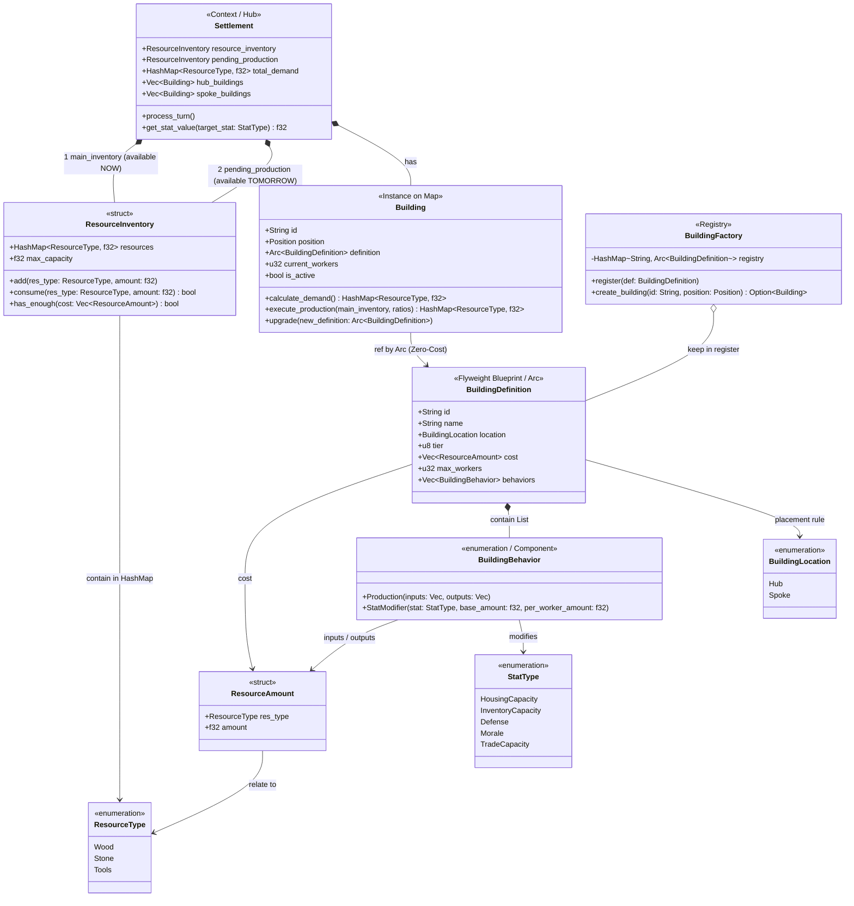
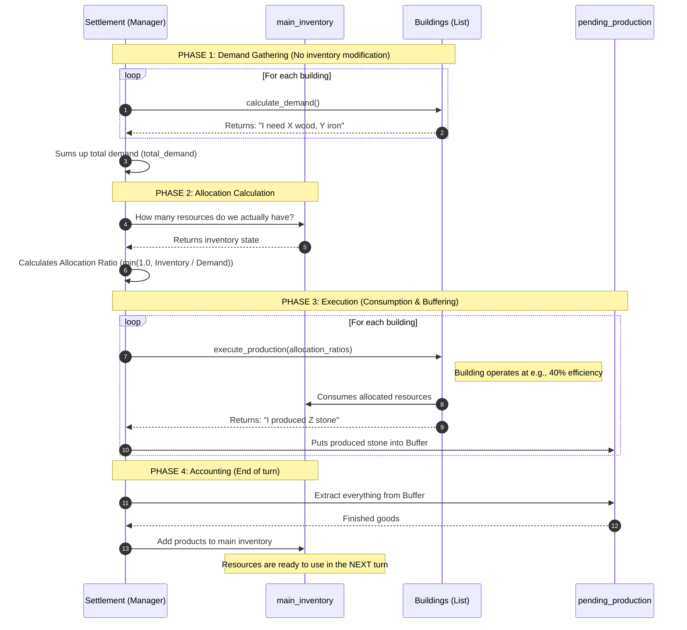
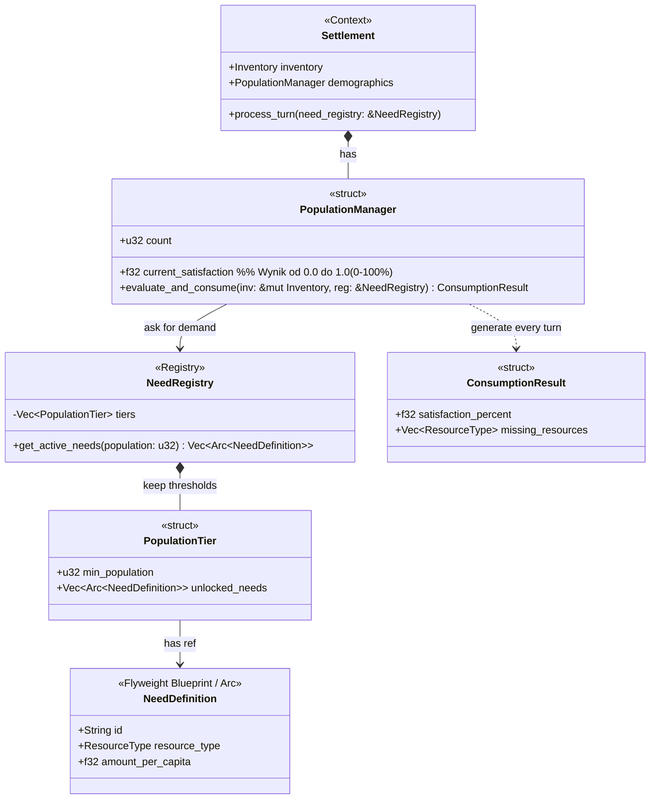
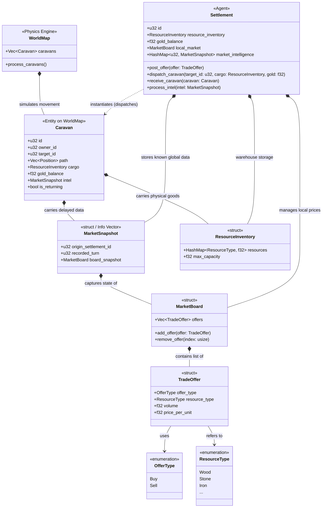

# Overview
Settlements serve as the primary autonomous agents within the MARL (Multi-Agent Reinforcement Learning) environment. From an implementation perspective, they act as the central hubs where spatial physics and economic logic intersect.

## Core Design Principles

- **Independent AI Agents:** Each settlement operates as a distinct, self-contained RL agent. Its primary objective is to optimize workforce allocation and supply chains.
    
- **Sphere of Influence:** Settlements are bound to the physical World Map. Every settlement controls a specific territorial zone, which dictates its spatial boundaries for expansion and resource harvesting.
    
- **Hub & Spoke Architecture:** The internal structure of a settlement is strictly divided to force strategic trade-offs:
    
    - **The Hub (Urban Center):** A highly constrained area dedicated to advanced processing, infrastructure, and housing.
        
    - **The Spokes (Resource Nodes):** Distributed extraction sites placed within the Sphere of Influence. Goods produced here incur a logistical penalty based on their distance to the Hub.
        
- **Economic Loop:** To grow, the settlement must balance local extraction with global trade (Caravans), dynamically reacting to the escalating needs of its population across different progression tiers.

# Building Architecture & Implementation

To ensure maximum performance during MARL (Multi-Agent Reinforcement Learning) simulations, the building system strictly separates immutable data from dynamic state using the **Flyweight** and **Component** design patterns.

### 1. Definitions vs. Instances

Building's data is split into two layers:

- **`BuildingDefinition` (The Blueprint):** Stored centrally in the `BuildingFactory` registry. It contains immutable properties such as the building's `name`, `tier`, `cost`, `max_workers`.
    
- **`Building` (The Instance):** The physical entity placed on the map. It is incredibly lightweight, containing only its unique `id`, `position`, `current_workers`, and a zero-cost atomic reference (`Arc`) to its underlying blueprint.

### 2. Zoning System (Hub vs. Spoke)

Buildings are strictly classified by their `BuildingLocation` enum, which tell where the AI agent can placed them:

- **Hub:** Tightly packed in the settlement's center.
    
- **Spoke:** Distributed across the settlement's territorial grid.

### 3. Component-Based Behaviors

Instead of deep inheritance trees, building functionalities are driven by a modular `BuildingBehavior` enum. During a simulation tick (`process_tick`), a building executes its assigned behaviors based on its active workforce: 
- **Production:** Consumes specific inputs from the settlement's `ResourceInventory` and yields outputs. 
- **Stat Modifier:** A unified system that alters global settlement statistics (e.g., `HousingCapacity`, `InventoryCapacity`, `Defense`). 

### 4. Zero-Cost Upgrades

Because building logic is entirely decoupled from the instance, upgrading a building is an $O(1)$ operation. The engine simply swaps the `Arc<BuildingDefinition>` pointer to the higher-tier blueprint. 

### 5. Turn procedure for building production
The production engine uses a deterministic, two-pass buffered architecture to eliminate race conditions. Buildings cannot instantly consume goods produced in the same turn. Instead, total demand is aggregated, resources are proportionally allocated, and all new products are temporarily buffered until the next turn.

# Population & Needs Management

The population system operates on a dynamic **Satisfaction System**. This architecture provides a granular, normalized metric (ranging from 0.0 to 1.0).
### 1. The Needs Registry (Data Layer)

Population demands are entirely data-driven and stored centrally. This completely decouples progression milestones from the settlement's internal logic:

- **`NeedRegistry`:** The global repository containing all demographic milestones.
    
- **`PopulationTier`:** Defines specific thresholds (`min_population`) that, once reached, unlock a new set of demands for the citizens.
    
- **`NeedDefinition`:** A blueprint specifying the required `ResourceType` and the exact `amount_per_capita` consumed per turn. 

### 2. The Population Manager (Logic Layer)

Each `Settlement` delegates its demographic state to the `PopulationManager`. The manager dynamically queries the `NeedRegistry` to retrieve the `unlocked_needs` applicable to its current population `count`.

### 3. Evaluation & Satisfaction (MARL Integration)

At the end of a turn, the `process_turn` method triggers the `evaluate_and_consume` function. This executes the core consumption loop:

1. It calculates the total volume required for each active need (Per Capita × Population Count) and attempts to withdraw it from the `ResourceInventory`.
    
2. Every active need carries an **equal proportional weight**. 
    
3. The method yields a `ConsumptionResult`, which contains the final `satisfaction_percent` and a list of `missing_resources`.
    

# Trading
## 1. Local Marketboards (Offers & Proposals)

Each `Settlement` maintains its own `MarketBoard`. AI agents explicitly post **Trade Offers**.

- **`TradeOffer`:** A structured proposal indicating the intent to Buy or Sell, the target `ResourceType`, the requested volume, and the accepted price in Gold.
    
- Agents can adjust their Marketboards every turn based on their needs.
    
- To initiate trade, a settlement dispatches a Caravan specifically targeting a known offer in another settlement.
    

## 2. Gold as a Sovereign Currency

To reflect its role as a universal medium of exchange, **Gold is mechanically separated from standard resources**.

- **Zero-Weight Exemption:** Gold is not stored in the `ResourceInventory` and does not consume `max_capacity`.
    
- **Logistics Exemption:** Transporting Gold does not consume standard caravan cargo limits.
    
- **Implementation:** It is tracked as a dedicated primitive field (`gold_balance: f32`) on both the `Settlement` and the `Caravan` entities. 
    

## 3. Caravans as Information Vectors (Delayed Observability)

In a Multi-Agent Reinforcement Learning (MARL) environment, dealing with the "Fog of War" is critical. Agents do not inherently know the prices or inventory levels of distant settlements. Instead, **Caravans act as physical data carriers**.

When a Caravan departs from a settlement (or passes through one), it captures a `MarketSnapshot`:

- **The Payload:** A lightweight data struct containing the departure settlement's current `MarketBoard`.
    
- **Information Delivery:** When the Caravan arrives at its destination, it injects this `MarketSnapshot` into the receiving Settlement's intelligence pool.
    
- **Agent Impact:** The receiving AI agent updates its Observation Space with this newly acquired data. This creates a highly realistic, delayed information network where market knowledge is only as fresh as the last arriving Caravan, forcing the AI to account for temporal uncertainty  when dispatching its own merchants.

